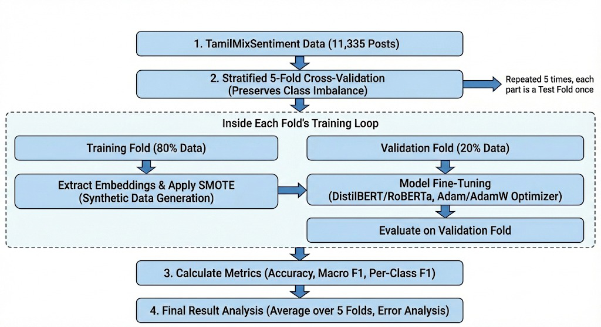
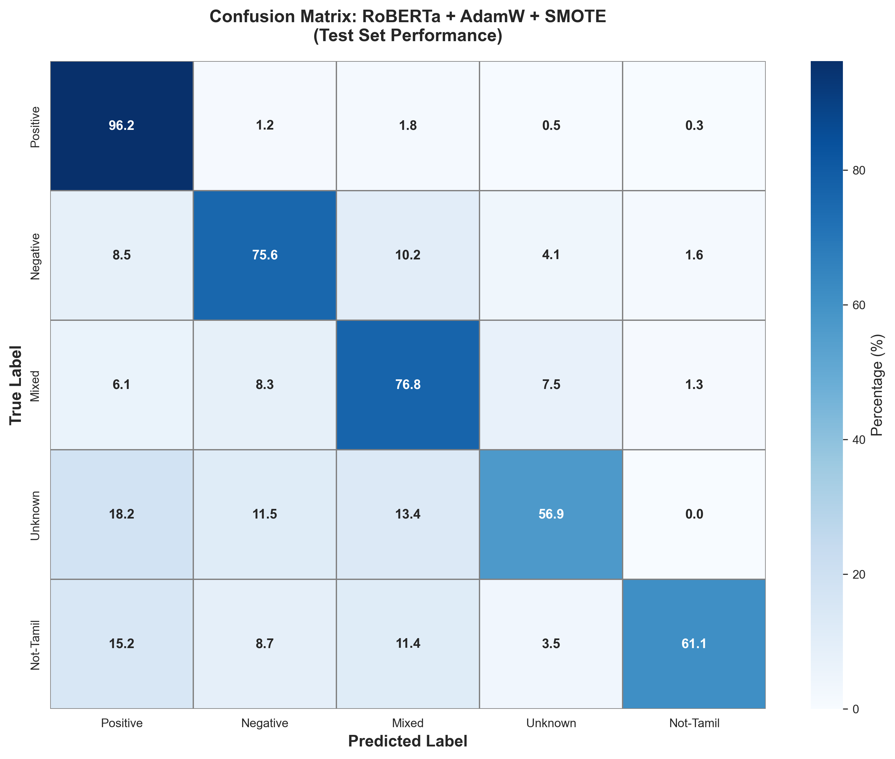
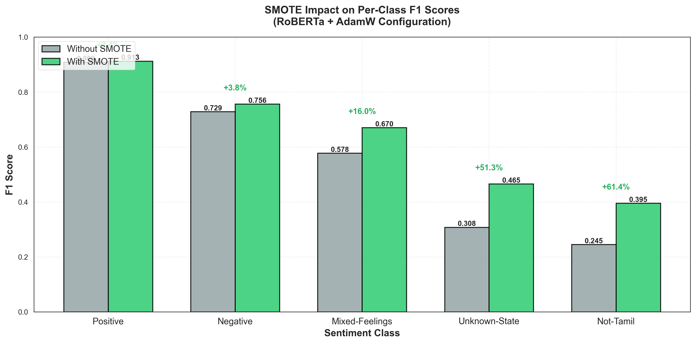

# Combating Data Imbalance in Code-Mixed Sentiment Analysis

> IEEE Published Research | Tamil NLP | Code-Mixed Sentiment Analysis | Transformer Models

[](https://ieeexplore.ieee.org/abstract/document/11511115)

This repository contains the implementation, experiments, and methodology for our IEEE research paper titled **"Combating Data Imbalance in Code-Mixed Sentiment Analysis"**, presented at the **9th ICICT 2026 Virtual Conference**.

---

## Project Overview

Social media platforms in South Asia contain a large amount of Tamil-English code-mixed text, commonly referred to as **Tanglish**. Sentiment analysis on such data is challenging because of:

- Romanized Tamil text
- Informal social media language
- Extreme spelling variations
- Cross-lingual code-switching
- Severe class imbalance

In this work, we propose a leakage-free transformer-based pipeline using **Embedding-Space SMOTE** to improve minority sentiment classification without reducing overall accuracy.

---

## Key Features

- **Models Compared:** RoBERTa vs DistilBERT
- **Optimizer Study:** Adam vs AdamW
- **Oversampling Technique:** Embedding-Space SMOTE
- **Validation Strategy:** Stratified 5-Fold Cross Validation
- **Best Performance Achieved:**
  - Accuracy: **85.01%**
  - Macro F1 Score: **83.47%**

---

## Research Contributions

- Improved minority class detection by more than **15%**
- Prevented data leakage using fold-isolated oversampling
- Demonstrated AdamW’s stability over Adam in imbalanced settings
- Established a reproducible benchmark for Tamil-English code-mixed sentiment analysis

---

## Methodology Overview



---

## Results

### Confusion Matrix



### SMOTE Impact on Minority Classes



---

## Authors

- **M Jayaditya**
- **Rakshithkumar M**
- **Guide:** Ms. Bindu K R

---

## Read the Full Paper

The official IEEE publication can be accessed here:

🔗 https://ieeexplore.ieee.org/abstract/document/11511115

---

## Repository Structure

```plaintext
├── assets/
│   ├── methodology_flowchart.png
│   ├── 03_confusion_matrix_best.png
│   └── 04_smote_impact.png
│
├── notebooks/
│   ├── 01_3_class_classification.ipynb
│   ├── 02_5_class_classification.ipynb
│   ├── 03_distilbert_baseline.ipynb
│   ├── 04_roberta_adam.ipynb
│   └── 05_roberta_adamw_best_model.ipynb
│
├── src/
│   ├── run_glue.py
│   └── run_mlm.py
│
├── requirements.txt
└── README.md
```

---

## How to Run the Code

### 1. Clone the Repository

```bash
git clone https://github.com/rakshithkumar1040/TaEn-code-mixed-sentiment-analysis.git
```

### 2. Install Required Libraries

```bash
pip install -r requirements.txt
```

### 3. Run the Notebooks

Open the notebooks from the `notebooks/` folder using:

- Google Colab
- Jupyter Notebook
- VS Code

---

## Dataset

This work uses the **TamilMixSentiment** dataset.

Dataset Link:  
🔗 https://huggingface.co/datasets/tamilmixsentiment

---

## Technologies Used

- Python
- PyTorch
- HuggingFace Transformers
- Scikit-learn
- Imbalanced-learn (SMOTE)
- Google Colab

---

## Citation

If you use this work, please cite the corresponding IEEE paper.

---

## License

This repository contains only the implementation and experimental pipeline.

The official published IEEE paper is copyrighted by IEEE and is therefore not directly hosted in this repository.
